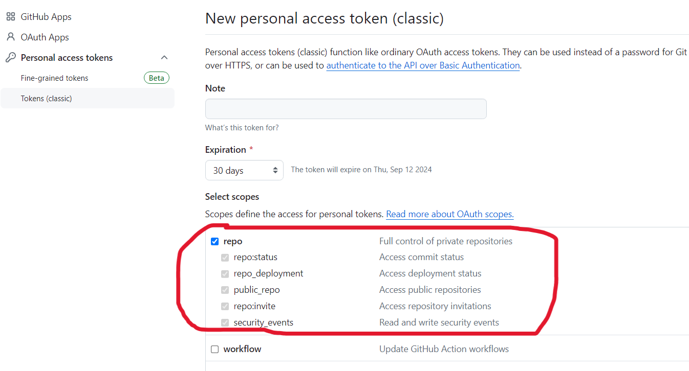

# code-review-openai-log

Set `main-code-review-jar.yml` in **Github Actions**
and fill the 6 configurations in it

- OUTLOOK_USERNAME: The username for the email account that will send notifications
- OUTLOOK_PASSWORD: The password or app-specific password for the email account
- RECEIVER_EMAIL: The username for the email account that will receive notifications (can set multi-receiver)
- GITHUB_REVIEW_LOG_URL: The URL of the GitHub repository where review logs will be stored
- GITHUB_TOKEN: A GitHub token with appropriate access rights
- CHATGPT_API_KEY: The API key to access the ChatGPT service

github repo token

outlook enable POP and SMTP

